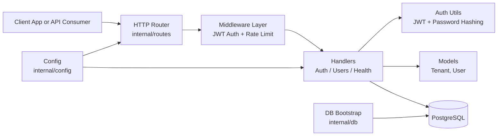
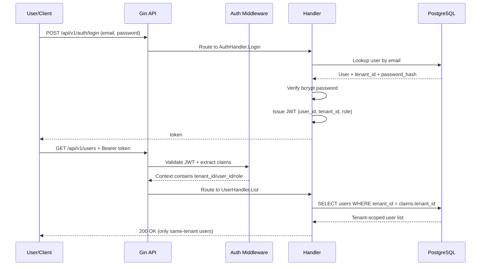
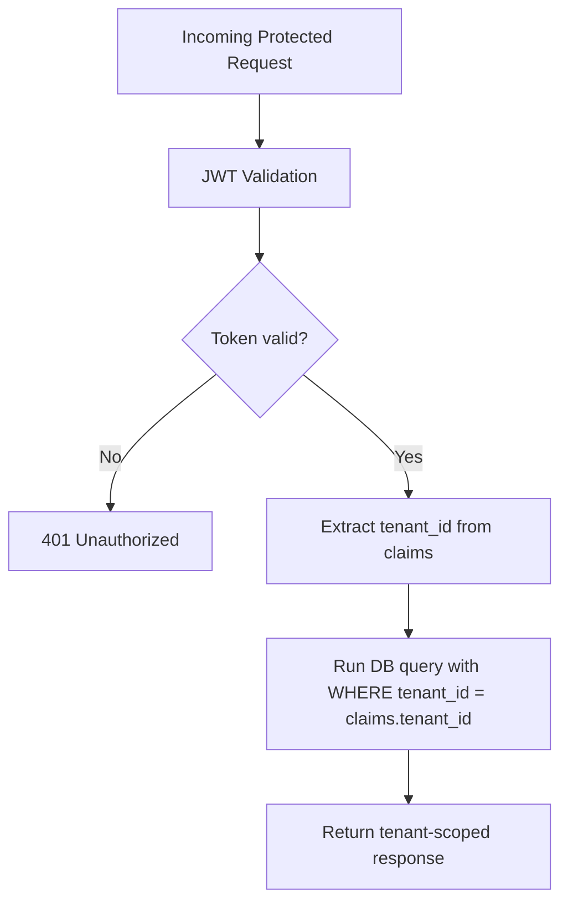

# Tenant SaaS Backend

Multi-tenant SaaS API backend built with Go, Gin, GORM, and PostgreSQL.

This README is written as a system design document with GitHub-rendered diagrams
(Mermaid), so architecture is visible directly on the repository page.

## 1) What This Project Does

`Tenant-Saas-Backend` provides a secure backend for SaaS applications where many
tenants (organizations) share one application instance and one database.

Core capabilities:

- Tenant onboarding: create tenant + first admin user.
- Authentication: login and receive JWT token.
- Authorization: protect APIs and enforce role-based access.
- Tenant isolation: every protected query is scoped to the tenant in JWT claims.
- Health and operational readiness endpoints for local/dev deployment.

## 2) High-Level Architecture



## 3) Request Lifecycle (How It Works)



## 4) Tenant Isolation Model



Design rule:

- The backend never trusts tenant identifiers from request body/query/path for
   authorization decisions.
- Tenant context is derived from signed JWT claims only.

## 5) Tech Stack

| Layer | Technology |
|---|---|
| Language | Go 1.26 |
| HTTP Framework | Gin |
| ORM | GORM + PostgreSQL driver |
| Database | PostgreSQL |
| AuthN/AuthZ | JWT (HS256), role checks |
| Password Security | bcrypt hashing |
| Local Infra | Docker Compose |
| Tooling | Makefile (`build`, `run`, `test`, `fmt`, `vet`) |

## 6) Project Structure

```text
cmd/server/main.go               Application entrypoint
internal/config/config.go        Environment-based configuration
internal/db/db.go                DB connection and initialization
internal/models/tenant.go        Tenant model
internal/models/user.go          User model
internal/auth/jwt.go             JWT generation and validation
internal/auth/password.go        Password hash/verify helpers
internal/middleware/auth.go      JWT/role middleware
internal/middleware/ratelimit.go Rate limiter for auth endpoints
internal/handlers/               HTTP handlers (auth, users, health)
internal/routes/routes.go        Route registration
```

## 7) API Surface

| Method | Path | Auth | Purpose |
|---|---|---|---|
| GET | `/health` | No | Liveness check |
| POST | `/api/v1/auth/register` | No | Create tenant + first admin |
| POST | `/api/v1/auth/login` | No | Authenticate and return JWT |
| GET | `/api/v1/me` | Yes | Return caller identity |
| GET | `/api/v1/users` | Yes | List users for caller tenant |

### Example: Register

```json
{
   "tenant_name": "Acme Inc",
   "tenant_slug": "acme",
   "email": "admin@acme.com",
   "password": "supersecret123"
}
```

### Example: Login

```json
{
   "email": "admin@acme.com",
   "password": "supersecret123"
}
```

Use token as:

```http
Authorization: Bearer <token>
```

## 8) Local Setup

```bash
cp .env.example .env
make db-up
make run
```

Server default: `http://localhost:8080`.

## 9) Development Commands

```bash
make build
make test
make test-verbose
make vet
make fmt
make db-up
make db-down
```

## 10) Security Notes

- Set a strong `JWT_SECRET` before non-local use.
- Auth endpoints are rate-limited (`20 req/min`, burst `5`) to reduce brute force risk.
- Current rate limiter is in-memory per instance; for multi-instance deployments,
   move to shared storage (for example Redis-backed rate limiting).
