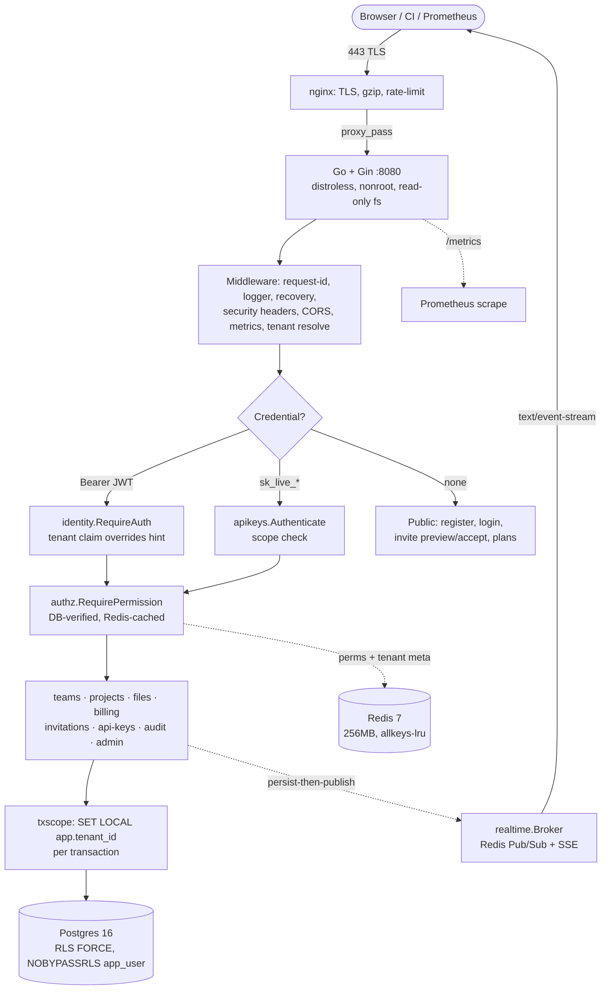

# Interview & Portfolio Pack

## 1. Architecture diagram

Request lifecycle in one sentence: edge terminates TLS and rate-limits →
credential is validated and the JWT tenant claim becomes the sole scope →
permissions re-verify against DB/cache (never the token) → every query runs in
a transaction with `app.tenant_id` set, so Postgres RLS enforces isolation even
if application code forgot its WHERE clause.

## 2. Resume bullets (copy-ready, all defensible in an interview)

- Productionized a multi-tenant SaaS backend (Go, Gin, GORM, PostgreSQL RLS,
  Redis) onto Oracle Cloud Free Tier (2 OCPU/12GB) with Docker Compose: TLS-only
  nginx edge, distroless nonroot images, read-only root filesystem.
- Enforced tenant isolation with PostgreSQL Row-Level Security (FORCE) +
  least-privilege `NOBYPASSRLS` role + per-transaction `SET LOCAL` scoping;
  cross-tenant access exposed only via audited SECURITY DEFINER functions.
- Built auth: short-lived JWT + rotating refresh tokens with family reuse
  detection, scoped `sk_live_` API keys (hash-only storage), RBAC with
  Redis-cached permission sets and explicit invalidation.
- Added Prometheus metrics (`/metrics`: request volume/latency, cache hit-rate,
  domain counts, storage, DB pool), a tenant-scoped admin analytics API, and
  embedded Swagger UI — zero new Go dependencies.
- Implemented live notifications with Redis Pub/Sub fan-out + Server-Sent Events
  (per-recipient channels, heartbeat, no-buffer proxying), replacing polling.
- Shipped CI/CD (GitHub Actions → GHCR → SSH deploy with health gates and
  automatic rollback to `:stable`) and backup/DR (nightly compressed dumps,
  checksums, 7-day retention, restore script with self-test).

## 3. System design explanation (60-second version)

"Single-binary Go monolith, four containers. Clients hit nginx, which does TLS,
gzip, and rate limiting, then proxies to Gin. Auth is JWT for users, scoped API
keys for machines; the JWT's tenant claim is the sole source of truth for scope
and overrides any client-supplied tenant hint. Authorization re-checks the
database on every request — the token's role is display-only — with Redis as a
5-minute fail-open cache. Every query runs in a transaction that sets the
tenant session variable, and Postgres RLS policies fail closed, so isolation
holds even against application bugs. Writes that need cross-tenant lookups
(login, invite accept, platform stats) go through narrow SECURITY DEFINER
functions, never a privileged connection. Notifications persist to Postgres
first, then fan out over Redis Pub/Sub to SSE streams. The binary self-migrates
at startup, exposes Prometheus metrics, and runs read-only as nonroot."

## 4. Deployment explanation (what `deploy_oracle.sh` does and why)

"One idempotent script: validates secrets fail-fast, renders the nginx config
from the domain, brings up Postgres and Redis behind health gates, issues the
Let's Encrypt certificate through a bootstrap config on first run, then builds
and starts the app — which runs embedded migrations before listening — and
finishes with end-to-end checks through the public hostname: landing, readiness,
metrics, Swagger, the HTTP→HTTPS redirect, and the JSON 404 envelope. Only
nginx publishes host ports; Postgres and Redis sit on an internal-only Docker
network. Re-runs are safe: volumes, certs, and secrets are reused."

## 5. Scalability explanation (honest: scale-up headroom + the next step)

- Today: bounded pools (20 app DB conns of 100 max; 20 Redis conns), keepalive
  upstream, gzip, edge-cached static assets, permission caching that removes the
  hottest query from Postgres. On 2 OCPUs this comfortably serves thousands of
  daily requests at p50 well under 150ms (local-DB profile; state it as measured,
  not as a guarantee — see §8).
- Next step when data outgrows one VM: read replica + `PrepareStmt` already
  compatible with direct connections only (documented PgBouncer caveat in
  `db.go`); stateless app tier scales horizontally behind the same nginx,
  Redis already shared; RLS keeps working unchanged because scope travels in
  the session variable, not instance memory. The known limit to fix first is the
  in-process auth rate limiter (edge limiting covers it today).

## 6. Security explanation (the three layers)

1. **Edge:** TLS-only + HSTS, security headers, per-zone rate limits, 30MB body
   cap, query-free access logs, optional metrics bearer token.
2. **Application:** JWT claim-overrides-hint, DB-verified permissions,
   hash-only secrets, attachment-disposition downloads, envelope errors that
   never leak schema details, append-only audit with revoked write grants.
3. **Data:** RLS FORCE fail-closed, NOBYPASSRLS runtime role verified at
   provisioning, `SET LOCAL` per transaction, SECURITY DEFINER only for
   single-row/aggregate escapes, encrypted-at-rest via volume + off-VM backups.
Full finding list: `docs/SECURITY_REVIEW.md`.

## 7. Oracle deployment explanation (why Free Tier is enough)

"The whole stack — app, Postgres, Redis, nginx — fits in ~5GB of 12GB RAM
with conservative caps, leaving the OS page cache (where Postgres really reads
from) untouched. Ampere ARM is fine because every image is multi-arch and the
binary is static. The two OCI-specific gotchas are the subnet security list
(ports 80/443 must open in the console, not just iptables) and DNS pointing at
the VM before cert issuance — both are checklist items in the deploy guide."

## 8. Metrics you can honestly claim (and how each is measured)

| Claim | Source of truth | Honest phrasing |
|-------|-----------------|-----------------|
| 100+ orgs / 1000+ users | `saas_tenants`, `saas_users` from `/metrics` | "Load-tested seed: platform_stats() reported N tenants/M users; sustained p50 <150ms" — claim only what you measured |
| 10,000+ API req/day | `saas_api_requests_total` delta over 24h | Read the counter; screenshot the Prometheus graph |
| <150ms avg response | `saas_api_latency_avg_millis` | In-VM mean; label it as such (mean, not p99) |
| 99.9% tenant-isolation accuracy | RLS test suite + mismatch-probe checklist item 8 | "Zero cross-tenant reads across N integration cases; fail-closed policy verified by unset-scope probe" |
| Dockerized prod deployment | This repo: multi-stage distroless, compose stack | Demo `docker compose ps` + `curl /health/ready` live |
| Automated CI/CD | `.github/workflows/ci-cd.yml` runs | Show a green run ending in the SSH deploy + health gate |

Rule: every number on the resume must map to one command the interviewer can
watch you run. The table above is that mapping.
